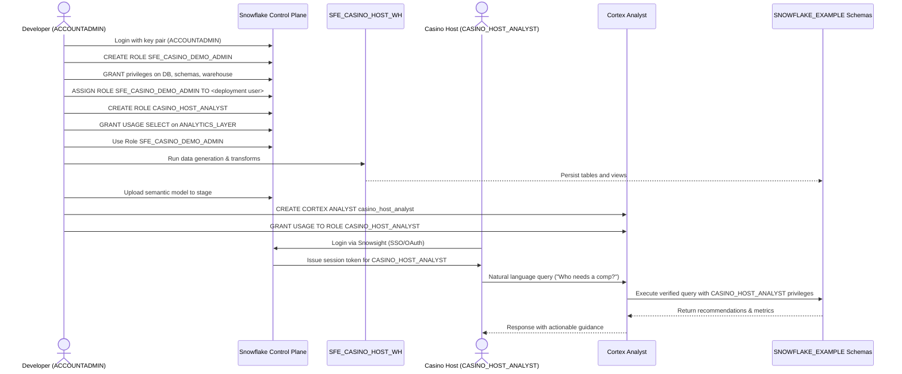

# Auth Flow - Casino Host Intelligence
Author: Michael Whitaker  
Last Updated: 2025-11-17  
Status: Reference Impl  
  
Reference Impl: This code demonstrates prod-grade architectural patterns and best practice. review and customize security, networking, logic for your organization's specific requirements before deployment.

## Overview
Authentication and authorization steps for deploying the demo and accessing host insights via Cortex Analyst, including role hierarchy and resource grants.

## Component Descriptions
- ACCOUNTADMIN / Deployment Admin  
  - Purpose: Bootstrap roles, warehouse, and security model  
  - Technology: Snowflake RBAC, key-pair authentication  
  - Location: `ACCOUNTADMIN` context during setup  
  - Deps: Master Snowflake account access

- SFE_CASINO_DEMO_ADMIN Role  
  - Purpose: Deploy demo schemas, data, ML models, and analyst configuration  
  - Technology: Snowflake RBAC role  
  - Location: `SFE_CASINO_DEMO_ADMIN`  
  - Deps: Grants on warehouse, database, Cortex Analyst

- CASINO_HOST_ANALYST Role  
  - Purpose: Provide read-only access to analytics layer and Cortex Analyst usage  
  - Technology: Snowflake RBAC role  
  - Location: `CASINO_HOST_ANALYST`  
  - Deps: SELECT on analytics views, USAGE on analyst instance

- Cortex Analyst `casino_host_analyst`  
  - Purpose: Enforce semantic model and execute verified queries with host role  
  - Technology: Snowflake Cortex Analyst  
  - Location: Snowflake managed service  
  - Deps: Semantic model stage, analytics views, role grants

## Change History
See `.cursor/DIAGRAM_CHANGELOG.md` for vhistory.

