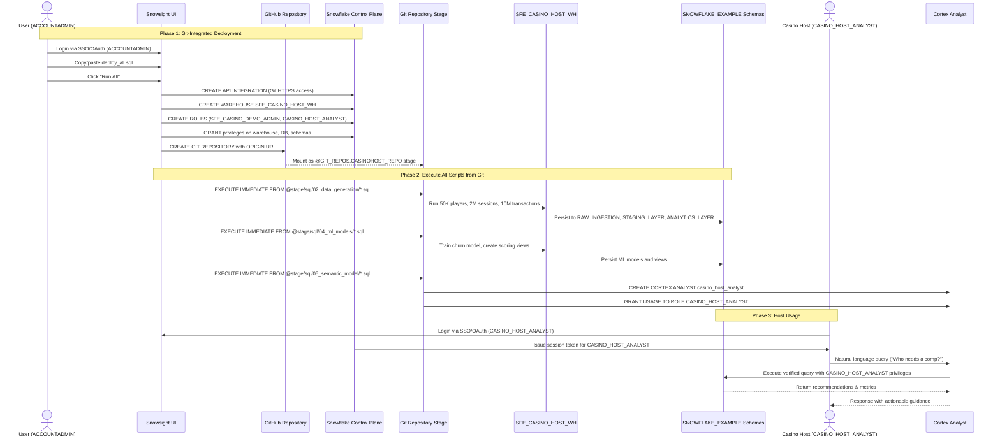

# Auth Flow - Casino Host Intelligence
Author: Michael Whitaker  
Last Updated: 2025-11-21  
Status: Reference Impl  
  
Reference Impl: This code demonstrates prod-grade architectural patterns and best practice. review and customize security, networking, logic for your organization's specific requirements before deployment.

## Overview
Authentication and authorization steps for Git-integrated deployment via Snowsight and accessing host insights via Cortex Analyst, including role hierarchy, Git repository access, and resource grants.

## Component Descriptions

### Deployment Components
- **User (ACCOUNTADMIN)**  
  - Purpose: Deploy demo via Snowsight using `deploy_all.sql`  
  - Technology: Snowflake RBAC, SSO/OAuth or key-pair authentication  
  - Location: `ACCOUNTADMIN` context during deployment  
  - Deps: Master Snowflake account access, network access to GitHub

- **Snowsight UI**  
  - Purpose: Primary deployment interface for copy/paste workflow  
  - Technology: Snowflake web interface (HTTPS 443)  
  - Location: Browser-based, `<account>.snowflakecomputing.com`  
  - Workflow: Copy entire `deploy_all.sql` → Paste → Click "Run All"

- **GitHub Repository**  
  - Purpose: Host all SQL scripts for Git-integrated deployment  
  - Technology: Public GitHub repository  
  - Location: `https://github.com/sfc-gh-miwhitaker/casinohost`  
  - Access: Public, no authentication required

- **Git Repository Stage**  
  - Purpose: Mount GitHub repo as Snowflake stage for `EXECUTE IMMEDIATE FROM`  
  - Technology: Snowflake Git Repository object with API Integration  
  - Location: `@SNOWFLAKE_EXAMPLE.GIT_REPOS.CASINOHOST_REPO`  
  - Pattern: `@stage/branches/main/sql/<directory>/<script>.sql`

- SFE_CASINO_DEMO_ADMIN Role  
  - Purpose: Deploy demo schemas, data, ML models, and analyst configuration  
  - Technology: Snowflake RBAC role  
  - Location: `SFE_CASINO_DEMO_ADMIN`  
  - Deps: Grants on warehouse, database, Cortex Analyst

- CASINO_HOST_ANALYST Role  
  - Purpose: Provide read-only access to analytics layer and Cortex Analyst usage  
  - Technology: Snowflake RBAC role  
  - Location: `CASINO_HOST_ANALYST`  
  - Deps: SELECT on analytics views, USAGE on analyst instance

- Cortex Analyst `casino_host_analyst`  
  - Purpose: Enforce semantic model and execute verified queries with host role  
  - Technology: Snowflake Cortex Analyst  
  - Location: Snowflake managed service  
  - Deps: Semantic model stage, analytics views, role grants

## Change History
See `.cursor/DIAGRAM_CHANGELOG.md` for vhistory.

