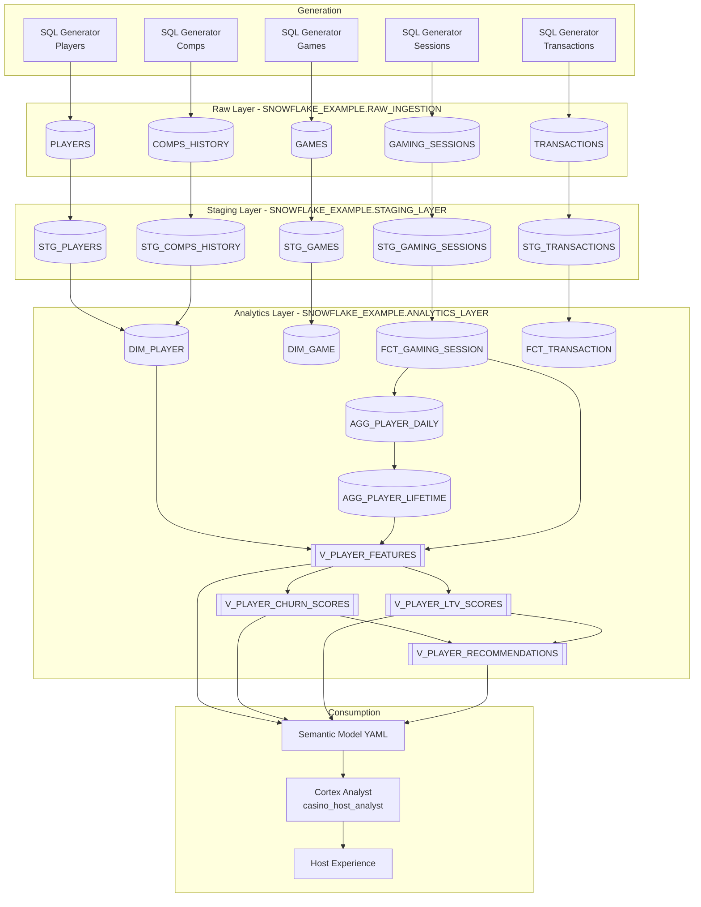

# Data Flow - Casino Host Intelligence
Author: Michael Whitaker  
Last Updated: 2025-11-17  
Status: Reference Impl  
  
Reference Impl: This code demonstrates prod-grade architectural patterns and best practice. review and customize security, networking, logic for your organization's specific requirements before deployment.

## Overview
End-to-end journey of synthetic casino data from raw generation through staging, analytics modeling, ML feature creation, and Cortex Analyst consumption supporting casino host decisions.

## Component Descriptions
- Synthetic Generators  
  - Purpose: Generate statistically realistic casino demo data  
  - Technology: Snowflake SQL (`TABLE(GENERATOR())`, random functions)  
  - Location: `sql/02_data_generation/`  
  - Deps: `SNOWFLAKE_EXAMPLE.RAW_INGESTION` tables

- Staging Layer Tables  
  - Purpose: Standardize data types, cleanse values, add derived metrics  
  - Technology: SQL transformation scripts  
  - Location: `sql/03_transformations/10-50_stage_*.sql`  
  - Deps: Raw tables, Snowflake warehouse `SFE_CASINO_HOST_WH`

- Analytics Layer Facts & Dimensions  
  - Purpose: Provide dimensional model with aggregated session and transaction metrics  
  - Technology: SQL star-schema modeling  
  - Location: `sql/03_transformations/60-96_*.sql`  
  - Deps: Staging tables (`STAGING_LAYER` schemas)

- ML Feature & Scoring Views  
  - Purpose: Supply churn, LTV, and recommendation insights for hosts  
  - Technology: SQL views + Cortex ML classification  
  - Location: `sql/04_ml_models/`  
  - Deps: Analytics layer tables, Cortex ML runtime

- Semantic Model & Cortex Analyst  
  - Purpose: Deliver natural language access to host insights  
  - Technology: Mermaid YAML + Cortex Analyst service  
  - Location: `sql/05_semantic_model/`  
  - Deps: Feature views, stage `ANALYTICS_LAYER.SEMANTIC_MODELS`

## Change History
See `.cursor/DIAGRAM_CHANGELOG.md` for vhistory.

