# Data Model - Casino Host Intelligence

Author: Michael Whitaker  
Last Updated: 2025-11-21  
Status: Reference Impl


Reference Impl: This code demonstrates prod-grade architectural patterns and best practice. review and customize security, networking, logic for your organization's specific requirements before deployment.

## Overview

Dimensional model for casino host intelligence spanning three layers: raw ingestion of synthetic data, staging transformations, and analytics consumption with fact/dimension tables supporting ML-driven player insights.

```mermaid
erDiagram
    %% ========================================================================
    %% RAW_INGESTION SCHEMA - Source tables populated by synthetic generators
    %% ========================================================================
    
    RAW_PLAYERS {
        NUMBER player_id PK "Surrogate key (SEQ8)"
        STRING player_guid UK "UUID for external systems"
        DATE loyalty_join_date "Program entry date"
        STRING player_tier "Bronze|Silver|Gold|Platinum|Diamond"
        STRING age_group "21-29, 30-39, 40-49, 50-59, 60+"
        STRING gender "M|F|Non-Binary|Prefer Not"
        STRING home_state "Two-letter state code"
        STRING home_zip "Approximate ZIP code"
        STRING preferred_game_type "Slots|Table|Poker|Sportsbook"
        NUMBER average_session_minutes "Avg session duration"
        NUMBER visit_frequency_per_month "Monthly visit cadence"
        NUMBER average_daily_theoretical "ADT in USD"
        NUMBER lifetime_theoretical "Cumulative theoretical win"
        NUMBER lifetime_actual_loss "Actual net casino take"
        NUMBER lifetime_comp_value "Historical comp USD value"
        BOOLEAN marketing_opt_in "Marketing consent flag"
        BOOLEAN host_assigned "Dedicated host flag"
        STRING host_employee_id "Assigned host identifier"
        TIMESTAMP created_at "Record creation"
        TIMESTAMP updated_at "Last update"
    }
    
    RAW_GAMES {
        NUMBER game_id PK "Unique game identifier"
        STRING game_code UK "Short system code"
        STRING game_name "Display name"
        STRING game_type "Slots|Table|Poker|Sportsbook"
        NUMBER house_edge_pct "Theoretical edge percentage"
        STRING volatility_rating "Low|Medium|High"
        NUMBER min_bet_amount "Minimum wager USD"
        NUMBER max_bet_amount "Maximum wager USD"
        NUMBER average_session_length_minutes "Expected duration"
        BOOLEAN is_active "Currently available flag"
        TIMESTAMP created_at "Record creation"
    }
    
    RAW_GAMING_SESSIONS {
        NUMBER session_id PK "Surrogate key (SEQ8)"
        NUMBER player_id FK "→ PLAYERS.player_id"
        TIMESTAMP session_start_ts "Session start"
        TIMESTAMP session_end_ts "Session end"
        NUMBER session_duration_minutes "Duration"
        NUMBER total_wagered_amount "Total USD wagered"
        NUMBER total_won_amount "Total USD payout"
        NUMBER net_win_amount "Casino net (wagered - won)"
        NUMBER theoretical_win_amount "House edge × wagered"
        NUMBER comp_points_earned "Comp points from session"
        BOOLEAN host_interaction_flag "Host engagement indicator"
        STRING favorite_game_type "Most played game type"
        STRING day_part "Morning|Afternoon|Evening|Overnight"
        NUMBER visit_sequence_in_month "Visit ordinal"
        TIMESTAMP created_at "Record creation"
    }
    
    RAW_TRANSACTIONS {
        NUMBER transaction_id PK "Surrogate key (SEQ8)"
        NUMBER session_id FK "→ GAMING_SESSIONS.session_id"
        NUMBER player_id FK "→ PLAYERS.player_id"
        NUMBER game_id FK "→ GAMES.game_id"
        TIMESTAMP transaction_ts "Transaction timestamp"
        STRING transaction_type "BET|WIN|BONUS|COMP"
        NUMBER bet_amount "USD wagered"
        NUMBER payout_amount "USD won by player"
        NUMBER net_amount "Casino net"
        NUMBER theoretical_win_amount "Expected win (bet × edge)"
        STRING outcome "Win|Loss|Tie"
        BOOLEAN is_bonus "Bonus-driven wager"
        TIMESTAMP created_at "Record creation"
    }
    
    RAW_COMPS_HISTORY {
        NUMBER comp_id PK "Surrogate key (SEQ8)"
        NUMBER player_id FK "→ PLAYERS.player_id"
        DATE comp_date "Comp issue date"
        STRING comp_type "Meal|Room|Show|FreePlay|Cashback"
        STRING comp_channel "In-person|Mobile|Call|Email"
        NUMBER comp_value_amount "USD value"
        STRING host_employee_id "Authorizing host"
        STRING issued_by_system "Host|CRM|Auto"
        STRING redemption_status "Issued|Redeemed|Expired|Cancelled"
        DATE redemption_date "Redemption date if applicable"
        STRING trip_id "Visit identifier"
        NUMBER theoretical_basis_amount "Theo win justifying comp"
        STRING notes "Freeform notes"
        TIMESTAMP created_at "Record creation"
    }
    
    %% ========================================================================
    %% RELATIONSHIPS - RAW LAYER
    %% ========================================================================
    
    RAW_PLAYERS ||--o{ RAW_GAMING_SESSIONS : "plays"
    RAW_GAMES ||--o{ RAW_TRANSACTIONS : "used_in"
    RAW_GAMING_SESSIONS ||--o{ RAW_TRANSACTIONS : "contains"
    RAW_PLAYERS ||--o{ RAW_TRANSACTIONS : "wagers"
    RAW_PLAYERS ||--o{ RAW_COMPS_HISTORY : "receives"
    
    %% ========================================================================
    %% ANALYTICS_LAYER SCHEMA - Dimensional model for BI/ML consumption
    %% ========================================================================
    
    DIM_PLAYER {
        NUMBER player_id PK "Player dimension key"
        STRING player_guid UK "External UUID"
        DATE loyalty_join_date "Program entry"
        STRING player_tier "Current tier"
        STRING age_group "Age bracket"
        STRING gender "Gender identity"
        STRING home_state "State code"
        STRING home_zip "ZIP code"
        STRING preferred_game_type "Game preference"
        NUMBER average_session_minutes "Avg session duration"
        NUMBER visit_frequency_per_month "Monthly visits"
        NUMBER average_daily_theoretical "ADT"
        NUMBER lifetime_theoretical "Cumulative theo"
        NUMBER lifetime_actual_loss "Actual loss"
        NUMBER lifetime_comp_value "Comp value"
        BOOLEAN marketing_opt_in "Marketing consent"
        BOOLEAN host_assigned "Host assignment"
        STRING host_employee_id "Host ID"
        NUMBER loyalty_tenure_days "Days since join"
        BOOLEAN is_vip "VIP flag (Platinum|Diamond)"
        STRING adt_segment "ADT bracket"
        NUMBER total_sessions "Session count"
        NUMBER host_touch_sessions "Host interaction count"
        NUMBER sessions_last_30d "Recent activity"
        NUMBER sessions_last_90d "Recent activity"
        NUMBER total_comps_issued "Comp offer count"
        NUMBER comps_redeemed_count "Redeemed count"
        NUMBER redeemed_comp_value "Redeemed USD"
        TIMESTAMP last_session_ts "Most recent session"
        TIMESTAMP first_session_ts "First session"
        TIMESTAMP built_at "ETL timestamp"
    }
    
    DIM_GAME {
        NUMBER game_id PK "Game dimension key"
        STRING game_code UK "System code"
        STRING game_name "Display name"
        STRING game_type "Game category"
        NUMBER house_edge_pct "Theoretical edge"
        STRING volatility_rating "Volatility"
        NUMBER min_bet_amount "Min bet USD"
        NUMBER max_bet_amount "Max bet USD"
        NUMBER average_session_length_minutes "Expected duration"
        BOOLEAN is_active "Active flag"
        TIMESTAMP built_at "ETL timestamp"
    }
    
    FCT_GAMING_SESSION {
        NUMBER session_id PK "Session fact key"
        NUMBER player_id FK "→ DIM_PLAYER.player_id"
        STRING player_tier "Denormalized tier"
        BOOLEAN is_vip "Denormalized VIP"
        STRING adt_segment "Denormalized ADT bracket"
        STRING favorite_game_type "Game type"
        TIMESTAMP session_start_ts "Start timestamp"
        TIMESTAMP session_end_ts "End timestamp"
        NUMBER session_duration_minutes "Duration"
        NUMBER total_wagered_amount "Total wagered USD"
        NUMBER total_won_amount "Total won USD"
        NUMBER net_win_amount "Casino net USD"
        NUMBER theoretical_win_amount "Theoretical win USD"
        NUMBER comp_points_earned "Comp points"
        BOOLEAN host_interaction_flag "Host touch"
        STRING day_part "Time of day"
        NUMBER visit_sequence_in_month "Visit ordinal"
        DATE session_date "Date dimension"
        NUMBER wager_per_minute "Derived metric"
        NUMBER payout_ratio "Derived metric"
        NUMBER net_margin_pct "Derived metric"
        STRING visit_sequence_bucket "Categorized ordinal"
        TIMESTAMP staged_at "Staging timestamp"
        TIMESTAMP built_at "ETL timestamp"
    }
    
    FCT_TRANSACTION {
        NUMBER transaction_id PK "Transaction fact key"
        NUMBER session_id FK "→ FCT_GAMING_SESSION.session_id"
        NUMBER player_id FK "→ DIM_PLAYER.player_id"
        NUMBER game_id FK "→ DIM_GAME.game_id"
        TIMESTAMP transaction_ts "Transaction timestamp"
        STRING transaction_type "BET|WIN|BONUS|COMP"
        NUMBER bet_amount "Bet USD"
        NUMBER payout_amount "Payout USD"
        NUMBER net_amount "Net USD"
        NUMBER theoretical_win_amount "Theo win USD"
        STRING outcome "Win|Loss|Tie"
        BOOLEAN is_bonus "Bonus flag"
        TIMESTAMP staged_at "Staging timestamp"
        TIMESTAMP built_at "ETL timestamp"
    }
    
    AGG_PLAYER_DAILY {
        NUMBER player_id FK "→ DIM_PLAYER.player_id"
        DATE activity_date PK "Calendar date"
        NUMBER session_count "Sessions that day"
        NUMBER total_wagered "Total wagered USD"
        NUMBER total_won "Total won USD"
        NUMBER net_win "Net USD"
        NUMBER theoretical_win "Theo USD"
        NUMBER comp_points_earned "Comp points"
        NUMBER total_duration_minutes "Total play time"
        TIMESTAMP built_at "ETL timestamp"
    }
    
    AGG_PLAYER_LIFETIME {
        NUMBER player_id PK "→ DIM_PLAYER.player_id"
        NUMBER total_sessions "Lifetime sessions"
        NUMBER total_wagered "Lifetime wagered USD"
        NUMBER total_won "Lifetime won USD"
        NUMBER net_win "Lifetime net USD"
        NUMBER theoretical_win "Lifetime theo USD"
        NUMBER comp_points_earned "Lifetime comp points"
        NUMBER total_duration_minutes "Lifetime play time"
        TIMESTAMP first_session_ts "First session"
        TIMESTAMP last_session_ts "Last session"
        TIMESTAMP built_at "ETL timestamp"
    }
    
    %% ========================================================================
    %% RELATIONSHIPS - ANALYTICS LAYER
    %% ========================================================================
    
    DIM_PLAYER ||--o{ FCT_GAMING_SESSION : "participates"
    DIM_GAME ||--o{ FCT_TRANSACTION : "used_in"
    FCT_GAMING_SESSION ||--o{ FCT_TRANSACTION : "contains"
    DIM_PLAYER ||--o{ FCT_TRANSACTION : "wagers"
    DIM_PLAYER ||--o{ AGG_PLAYER_DAILY : "aggregated"
    DIM_PLAYER ||--|| AGG_PLAYER_LIFETIME : "summarized"
    
    %% ========================================================================
    %% VIEWS - ML/Analytics consumption layer
    %% ========================================================================
    
    V_PLAYER_FEATURES {
        NUMBER player_id PK "Player key"
        NUMBER recency_days "RFM: Days since last session"
        NUMBER frequency_sessions "RFM: Total sessions"
        NUMBER monetary_wagered "RFM: Lifetime wagered"
        NUMBER rfm_recency_score "RFM quintile (1-5)"
        NUMBER rfm_frequency_score "RFM quintile (1-5)"
        NUMBER rfm_monetary_score "RFM quintile (1-5)"
        NUMBER composite_rfm_score "Sum of RFM scores"
        NUMBER days_since_last_session "Recency metric"
        NUMBER sessions_last_30d "Activity metric"
        NUMBER sessions_last_90d "Activity metric"
        NUMBER total_wagered_last_30d "Recent spend"
        NUMBER avg_wager_per_session "Behavioral metric"
        NUMBER payout_ratio "Behavioral metric"
        NUMBER host_touch_rate "Engagement metric"
        NUMBER comp_redemption_rate "Engagement metric"
    }
    
    V_PLAYER_CHURN_SCORES {
        NUMBER player_id PK "Player key"
        NUMBER churn_probability "ML prediction (0-1)"
        STRING churn_risk_segment "High|Medium|Low Risk"
        NUMBER churn_prediction_flag "Binary prediction (0|1)"
        NUMBER recency_days "Feature input"
        NUMBER frequency_sessions "Feature input"
        NUMBER monetary_wagered "Feature input"
        NUMBER sessions_last_30d "Feature input"
        NUMBER sessions_last_90d "Feature input"
        NUMBER host_touch_rate "Feature input"
    }
    
    V_PLAYER_LTV_SCORES {
        NUMBER player_id PK "Player key"
        NUMBER composite_rfm_score "RFM total"
        STRING ltv_segment "VIP|High|Medium|Low Value"
        NUMBER ltv_quintile "1-5 ranking"
        NUMBER recency_days "RFM component"
        NUMBER frequency_sessions "RFM component"
        NUMBER monetary_wagered "RFM component"
    }
    
    V_PLAYER_RECOMMENDATIONS {
        NUMBER player_id PK "Player key"
        STRING recommended_action "Comp|Host_Touch|Monitor|Retain"
        NUMBER suggested_comp_value_usd "Comp offer amount"
        STRING recommendation_reason "Business rule explanation"
        NUMBER churn_probability "Risk score"
        STRING ltv_segment "Value segment"
        NUMBER days_since_last_session "Recency"
    }
    
    %% ========================================================================
    %% RELATIONSHIPS - VIEWS TO DIMENSIONS
    %% ========================================================================
    
    DIM_PLAYER ||--|| V_PLAYER_FEATURES : "enriched"
    V_PLAYER_FEATURES ||--|| V_PLAYER_CHURN_SCORES : "scored"
    V_PLAYER_FEATURES ||--|| V_PLAYER_LTV_SCORES : "segmented"
    V_PLAYER_CHURN_SCORES ||--|| V_PLAYER_RECOMMENDATIONS : "drives"
    V_PLAYER_LTV_SCORES ||--|| V_PLAYER_RECOMMENDATIONS : "drives"
```



## Component Descriptions

### RAW_INGESTION Schema (50K-10M rows)

**Purpose:** Landing zone for synthetically generated casino operational data

**PLAYERS (50,000 rows)**
- **Purpose:** Master player profiles with demographics and loyalty metrics
- **Technology:** Snowflake table populated by `GENERATOR` function
- **Location:** `sql/02_data_generation/10_generate_players.sql`
- **Key Attributes:** Loyalty tier (industry-validated 50/30/15/4/1 distribution), ADT (Average Daily Theoretical), tenure metrics, host assignment

**GAMES (~100 rows)**
- **Purpose:** Catalog of casino games with house edge and betting parameters
- **Technology:** Snowflake table with curated game definitions
- **Location:** `sql/02_data_generation/20_generate_games.sql`
- **Key Attributes:** Game type (Slots 55%, Table 25%, Poker 12%, Sportsbook 8%), house edge percentages, volatility ratings

**GAMING_SESSIONS (2,000,000 rows)**
- **Purpose:** Player session roll-ups with wagering totals and theoretical win calculations
- **Technology:** Snowflake table with temporal patterns (weekend spikes, peak hours)
- **Location:** `sql/02_data_generation/30_generate_gaming_sessions.sql`
- **Key Attributes:** Session duration (log-normal distribution), total wagered, net win, theoretical win, comp points earned, host interaction flag

**TRANSACTIONS (10,000,000 rows)**
- **Purpose:** Granular bet/win/payout events with game-level detail
- **Technology:** Snowflake table modeling individual wagers
- **Location:** `sql/02_data_generation/40_generate_transactions.sql`
- **Key Attributes:** Transaction type (BET, WIN, BONUS, COMP), bet/payout amounts, theoretical win calculations, win/loss/tie outcomes

**COMPS_HISTORY (500,000 rows)**
- **Purpose:** Complimentary offer issuance, authorization, and redemption tracking
- **Technology:** Snowflake table with comp economics
- **Location:** `sql/02_data_generation/50_generate_comps.sql`
- **Key Attributes:** Comp type (Meal 40%, Room 25%, FreePlay 20%, Show 10%, Cashback 5%), redemption status, host authorization, theoretical basis

---

### STAGING_LAYER Schema (50K-10M rows)

**Purpose:** Cleansed and standardized versions of raw tables with derived attributes

**Key Transformations:**
- Data type casting and NULL handling
- Derived metrics: `wager_per_minute`, `payout_ratio`, `net_margin_pct`, `visit_sequence_bucket`
- Date parsing: `session_date` extracted from `session_start_ts`
- Comp redemption lag: `days_to_redeem` calculated as `redemption_date - comp_date`

**Location:** `sql/03_transformations/10-50_stage_*.sql`

---

### ANALYTICS_LAYER Schema (50K-2M rows)

**Purpose:** Dimensional model optimized for BI dashboards, ML features, and Cortex Analyst consumption

**DIM_PLAYER (50,000 rows)**
- **Purpose:** Player dimension with lifetime metrics, RFM scores, and activity summaries
- **Technology:** Type 1 Slowly Changing Dimension (overwrite)
- **Location:** `sql/03_transformations/60_dim_player.sql`
- **Key Attributes:** Loyalty tenure, VIP flag (Platinum/Diamond), ADT segment (Low <$300, Mid $300-700, High >$700), total sessions, host touch rate, comp redemption metrics

**DIM_GAME (~100 rows)**
- **Purpose:** Game dimension with profitability metrics
- **Technology:** Type 1 SCD
- **Location:** `sql/03_transformations/70_dim_game.sql`
- **Key Attributes:** House edge percentage, volatility rating, bet limits, expected session length

**FCT_GAMING_SESSION (2,000,000 rows)**
- **Purpose:** Fact table for session-level analysis with denormalized player attributes
- **Technology:** Transactional fact table
- **Location:** `sql/03_transformations/80_fct_gaming_session.sql`
- **Key Metrics:** Total wagered, net win, theoretical win, comp points earned, session duration, wager per minute

**FCT_TRANSACTION (10,000,000 rows)**
- **Purpose:** Fact table for transaction-level analysis (granular bet/win events)
- **Technology:** Transactional fact table
- **Location:** `sql/03_transformations/90_fct_transaction.sql`
- **Key Metrics:** Bet amount, payout amount, net amount, theoretical win

**AGG_PLAYER_DAILY (Pre-aggregated)**
- **Purpose:** Daily player metrics for fast dashboard queries
- **Technology:** Aggregate table refreshed via scheduled task
- **Location:** `sql/03_transformations/95_agg_player_daily.sql`
- **Key Metrics:** Daily sessions, daily wagered, daily net win, daily theoretical win

**AGG_PLAYER_LIFETIME (Pre-aggregated)**
- **Purpose:** Lifetime player metrics for fast dashboard queries
- **Technology:** Aggregate table refreshed via scheduled task
- **Location:** `sql/03_transformations/96_agg_player_lifetime.sql`
- **Key Metrics:** Lifetime sessions, lifetime wagered, lifetime net win, first/last session timestamps

---

### Views (ML/Analytics Consumption)

**V_PLAYER_FEATURES (50,000 rows)**
- **Purpose:** ML-ready feature set with RFM methodology and behavioral attributes
- **Technology:** Analytical view
- **Location:** `sql/04_ml_models/10_player_features_view.sql`
- **Key Features:** RFM quintile scores (1-5), composite RFM score (3-15), recency/frequency/monetary metrics, host touch rate, comp redemption rate

**V_PLAYER_CHURN_SCORES (50,000 rows)**
- **Purpose:** Churn probability predictions from Snowflake Cortex ML classification model
- **Technology:** View with lateral join to ML.CLASSIFICATION prediction
- **Location:** `sql/04_ml_models/20_churn_model.sql`
- **Key Metrics:** Churn probability (0-1), risk segment (High/Medium/Low), binary prediction flag

**V_PLAYER_LTV_SCORES (50,000 rows)**
- **Purpose:** Lifetime value segmentation using RFM quintile methodology
- **Technology:** Analytical view
- **Location:** `sql/04_ml_models/30_ltv_scoring_view.sql`
- **Key Segments:** VIP (score 12-15), High Value (9-11), Medium Value (6-8), Low Value (3-5)

**V_PLAYER_RECOMMENDATIONS (50,000 rows)**
- **Purpose:** Business rules-based next-best-action engine for casino hosts
- **Technology:** Analytical view with CASE logic
- **Location:** `sql/04_ml_models/40_recommendation_view.sql`
- **Recommendations:** Offer comp (High LTV + High churn), Host touch (VIP + Medium churn), Monitor (Medium LTV + Low activity), Retain (Low churn + Active)

---

## Relationships

### Primary Relationships (1:M - One to Many)

| From Table | To Table | Type | Description |
|------------|----------|------|-------------|
| **RAW_PLAYERS** | **RAW_GAMING_SESSIONS** | 1:M | One player has many gaming sessions |
| **RAW_GAMES** | **RAW_TRANSACTIONS** | 1:M | One game used in many transactions |
| **RAW_GAMING_SESSIONS** | **RAW_TRANSACTIONS** | 1:M | One session contains many bet/win transactions |
| **RAW_PLAYERS** | **RAW_TRANSACTIONS** | 1:M | One player makes many wagers |
| **RAW_PLAYERS** | **RAW_COMPS_HISTORY** | 1:M | One player receives many comp offers |
| **DIM_PLAYER** | **FCT_GAMING_SESSION** | 1:M | One player dimension links to many session facts |
| **DIM_GAME** | **FCT_TRANSACTION** | 1:M | One game dimension links to many transaction facts |
| **FCT_GAMING_SESSION** | **FCT_TRANSACTION** | 1:M | One session fact contains many transaction facts |
| **DIM_PLAYER** | **AGG_PLAYER_DAILY** | 1:M | One player has many daily aggregates |

### Key Relationships (1:1 - One to One)

| From Table | To Table | Type | Description |
|------------|----------|------|-------------|
| **DIM_PLAYER** | **V_PLAYER_FEATURES** | 1:1 | One player has one feature vector |
| **V_PLAYER_FEATURES** | **V_PLAYER_CHURN_SCORES** | 1:1 | One feature set produces one churn score |
| **V_PLAYER_FEATURES** | **V_PLAYER_LTV_SCORES** | 1:1 | One feature set produces one LTV score |
| **DIM_PLAYER** | **AGG_PLAYER_LIFETIME** | 1:1 | One player has one lifetime aggregate |

---

## Key Constraints

### Primary Keys (Unique, NOT NULL)

**RAW Layer:**
- `RAW_INGESTION.PLAYERS.player_id`
- `RAW_INGESTION.GAMES.game_id`
- `RAW_INGESTION.GAMING_SESSIONS.session_id`
- `RAW_INGESTION.TRANSACTIONS.transaction_id`
- `RAW_INGESTION.COMPS_HISTORY.comp_id`

**Analytics Layer:**
- `ANALYTICS_LAYER.DIM_PLAYER.player_id`
- `ANALYTICS_LAYER.DIM_GAME.game_id`
- `ANALYTICS_LAYER.FCT_GAMING_SESSION.session_id`
- `ANALYTICS_LAYER.FCT_TRANSACTION.transaction_id`
- `ANALYTICS_LAYER.AGG_PLAYER_DAILY.(player_id, activity_date)` (composite)
- `ANALYTICS_LAYER.AGG_PLAYER_LIFETIME.player_id`

### Foreign Keys (Enforced via JOIN logic, not constraints)

Snowflake does not enforce foreign key constraints, but logical relationships are:

**RAW Layer:**
- `RAW_GAMING_SESSIONS.player_id` → `RAW_PLAYERS.player_id`
- `RAW_TRANSACTIONS.session_id` → `RAW_GAMING_SESSIONS.session_id`
- `RAW_TRANSACTIONS.player_id` → `RAW_PLAYERS.player_id`
- `RAW_TRANSACTIONS.game_id` → `RAW_GAMES.game_id`
- `RAW_COMPS_HISTORY.player_id` → `RAW_PLAYERS.player_id`

**Analytics Layer:**
- `FCT_GAMING_SESSION.player_id` → `DIM_PLAYER.player_id`
- `FCT_TRANSACTION.session_id` → `FCT_GAMING_SESSION.session_id`
- `FCT_TRANSACTION.player_id` → `DIM_PLAYER.player_id`
- `FCT_TRANSACTION.game_id` → `DIM_GAME.game_id`
- `AGG_PLAYER_DAILY.player_id` → `DIM_PLAYER.player_id`
- `AGG_PLAYER_LIFETIME.player_id` → `DIM_PLAYER.player_id`

### Unique Constraints

- `RAW_INGESTION.PLAYERS.player_guid` (UUID for external system correlation)
- `RAW_INGESTION.GAMES.game_code` (Short system code)

### Business Rules (Enforced in SQL logic)

1. **Session Duration Validity:** `session_end_ts >= session_start_ts`
2. **Non-Negative Amounts:** All monetary columns (`total_wagered_amount`, `comp_value_amount`) >= 0
3. **Theoretical Win Calculation:** `theoretical_win_amount = total_wagered_amount × (house_edge_pct / 100)`
4. **Comp Points Calculation:** `comp_points_earned = theoretical_win_amount × comp_percentage`
5. **Churn Definition:** Player is churned if `days_since_last_session > 60` AND `sessions_last_90d >= 2`

---

## Schema Layers

| Layer | Purpose | Example Tables | Row Counts | Refresh Pattern |
|-------|---------|----------------|------------|-----------------|
| **RAW_INGESTION** | Unaltered synthetic data landing | PLAYERS, GAMES, GAMING_SESSIONS, TRANSACTIONS, COMPS_HISTORY | 50K-10M | One-time generation via `GENERATOR` |
| **STAGING_LAYER** | Cleansed and standardized with derived attributes | STG_PLAYERS, STG_GAMES, STG_GAMING_SESSIONS, STG_TRANSACTIONS, STG_COMPS_HISTORY | 50K-10M | Full refresh from RAW (idempotent) |
| **ANALYTICS_LAYER** | Dimensional model + ML views | DIM_PLAYER, DIM_GAME, FCT_GAMING_SESSION, FCT_TRANSACTION, V_PLAYER_FEATURES, V_PLAYER_CHURN_SCORES | 50K-2M | Full refresh from STAGING (idempotent) |

---

## Data Lineage Flow

```
GENERATOR Function (Synthetic)
    ↓
RAW_INGESTION Schema (Landing)
    ↓
STAGING_LAYER Schema (Cleansing + Derived Attributes)
    ↓
ANALYTICS_LAYER Dimensions & Facts (Star Schema)
    ↓
ANALYTICS_LAYER Views (ML Features + Scoring)
    ↓
Cortex Analyst (Natural Language Interface)
```

---

## Industry Validation

This data model incorporates casino industry standards:

| Standard | Implementation | Validation |
|----------|----------------|------------|
| **Loyalty Tier Distribution** | Bronze 50%, Silver 30%, Gold 15%, Platinum 4%, Diamond 1% | Verified in `10_generate_players.sql` |
| **Average Daily Theoretical (ADT)** | Low <$300, Mid $300-700, High $700-1500, VIP $1500+ | Verified via `NORMALLY_DISTRIBUTED_RANDOM` with mean $600, std $250 |
| **House Edge Ranges** | Slots 5-15%, Table 1-5%, Poker 2-5%, Sportsbook 4-7% | Verified in `20_generate_games.sql` |
| **Comp Percentage** | 20-40% of theoretical win | Verified in `30_generate_gaming_sessions.sql` |
| **Churn Definition** | No visit in 60+ days AND previously active (2+ sessions in 90d) | Verified in `20_churn_model.sql` |
| **Session Duration** | Slots 90 min, Table 120 min, Poker 180 min | Verified via `NORMALLY_DISTRIBUTED_RANDOM` |

---

## Change History

See `.cursor/DIAGRAM_CHANGELOG.md` for version history.

---

**Last Validated:** 2025-11-17  
**Tables:** 15 (5 RAW, 5 STAGING, 5 ANALYTICS)  
**Views:** 4 (ML/Analytics consumption)  
**Total Rows:** ~22M (10M transactions, 2M sessions, 50K players)  
**Storage Estimate:** ~500 MB (uncompressed), ~50 MB (Snowflake compressed)

