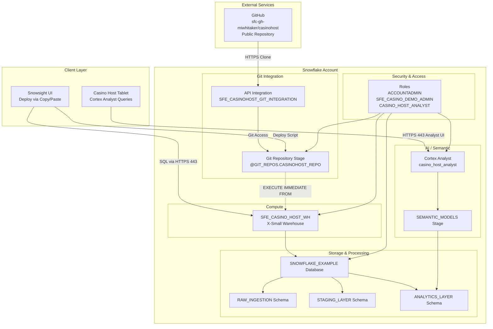

# Network Flow - Casino Host Intelligence
Author: Michael Whitaker  
Last Updated: 2025-11-21  
Status: Reference Impl  
  
Reference Impl: This code demonstrates prod-grade architectural patterns and best practice. review and customize security, networking, logic for your organization's specific requirements before deployment.

## Overview
Logical connectivity of demo components including Git-integrated deployment via Snowsight, GitHub repository access, Snowflake services, warehouses, and Cortex Analyst endpoints used by casino hosts.

## Component Descriptions

### External Services
- **GitHub Repository**  
  - Purpose: Host all SQL scripts, documentation, and deployment code  
  - Technology: GitHub public repository  
  - Location: `https://github.com/sfc-gh-miwhitaker/casinohost`  
  - Access: Public, no authentication required

### Client Layer
- **Snowsight UI**  
  - Purpose: Primary deployment interface via copy/paste of `deploy_all.sql`  
  - Technology: Snowflake web interface (HTTPS 443)  
  - Location: `<account>.snowflakecomputing.com`  
  - Deps: ACCOUNTADMIN role for initial deployment

- **Casino Host Tablet**  
  - Purpose: Access Cortex Analyst for natural language queries  
  - Technology: Browser-based Cortex Analyst UI  
  - Location: Snowsight interface  
  - Deps: CASINO_HOST_ANALYST role

### Git Integration
- **API Integration (SFE_CASINOHOST_GIT_INTEGRATION)**  
  - Purpose: Authorize Snowflake to access GitHub repository via HTTPS  
  - Technology: Snowflake API Integration object (git_https_api)  
  - Location: Account-level object  
  - Allowed Prefix: `https://github.com/sfc-gh-miwhitaker/`

- **Git Repository Stage (@GIT_REPOS.CASINOHOST_REPO)**  
  - Purpose: Mount GitHub repository as Snowflake stage for `EXECUTE IMMEDIATE FROM`  
  - Technology: Snowflake Git Repository object  
  - Location: `SNOWFLAKE_EXAMPLE.GIT_REPOS.CASINOHOST_REPO`  
  - Pattern: `@stage/branches/main/sql/...`

- SFE_CASINO_HOST_WH Warehouse  
  - Purpose: Execute synthetic data generation, transformations, and ML scoring  
  - Technology: Snowflake virtual warehouse (X-Small)  
  - Location: `SFE_CASINO_HOST_WH`  
  - Deps: `SFE_CASINO_DEMO_ADMIN` role grants

- SNOWFLAKE_EXAMPLE Database  
  - Purpose: Persist raw, staging, and analytics schemas for demo  
  - Technology: Snowflake database schemas  
  - Location: `SNOWFLAKE_EXAMPLE`  
  - Deps: Warehouse compute, storage services

- Cortex Analyst Instance  
  - Purpose: Provide natural language interface for casino hosts  
  - Technology: Snowflake Cortex Analyst service  
  - Location: `casino_host_analyst`  
  - Deps: Semantic model stage, `CASINO_HOST_ANALYST` role

- Semantic Model Stage  
  - Purpose: Store YAML definitions for Analyst deployments  
  - Technology: Snowflake internal stage  
  - Location: `ANALYTICS_LAYER.SEMANTIC_MODELS`  
  - Deps: Upload from developer workstation

## Change History
See `.cursor/DIAGRAM_CHANGELOG.md` for vhistory.

